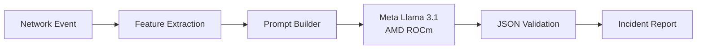

# SOCPilot AI

> SOCPilot AI is a fully local Security Operations Center (SOC) assistant developed for the AMD Radeon Hackathon 2026. It leverages Meta Llama 3.1 and AMD ROCm to automatically generate structured cybersecurity incident reports from summarized network events.


Powered by **Meta Llama 3.1** and **AMD ROCm**, SOCPilot AI transforms summarized cybersecurity events into structured incident reports.

Key capabilities:

- Attack classification
- MITRE ATT&CK mapping
- IOC extraction
- Severity assessment
- Response recommendations
---

# Project Overview

Security analysts spend considerable time investigating alerts generated by SIEM platforms.

SOCPilot AI automates part of this workflow by combining lightweight feature extraction with a locally deployed Meta Llama 3.1 model to produce structured incident reports.

---

### Dataset

This project uses the public **CICIDS2017** intrusion detection dataset for demonstration.

Kaggle Dataset:
https://www.kaggle.com/datasets/mdalamintalukder/cicids2017

The original dataset is **not redistributed** in this repository.

---

# Architecture



Runs entirely offline using **AMD ROCm** without external AI services.

---

# Key Features

- Fully local AI inference
- Meta Llama 3.1 8B
- AMD ROCm GPU acceleration
- Gradio Web interface
- Lightweight preprocessing pipeline
- Structured JSON incident reports
- Markdown report generation
- MITRE ATT&CK mapping
- IOC extraction
- Confidence scoring
- Security recommendations
- CICIDS2017 integration

---

# Repository Structure

```text
socpilot-ai/

├── app/
│   ├── __init__.py
│   ├── analyze_flow.py
│   ├── reporting.py
│   ├── summarize_dataset.py
│   ├── test_llm.py
│   └── web_demo.py
│
├── datasets/
│   └── .gitkeep
│
├── docs/
│   └── .gitkeep
│
├── outputs/
│   └── .gitkeep
│
├── requirements.txt
├── .gitignore
└── README.md
```

---

## Requirements

- Python 3.10+
- AMD ROCm
- PyTorch (ROCm)
- Hugging Face Transformers

---

# Quick Start

## Clone

```bash
git clone https://github.com/cyberbryanzhang/Radeon-hackathon-2026-07.git

cd Radeon-hackathon-2026-07/socpilot-ai
```

---

## Create Virtual Environment

```bash
python -m venv .venv
source .venv/bin/activate
```

---

## Install Dependencies

```bash
pip install -r requirements.txt
```

---

## Verify Environment

```bash
python app/test_llm.py
```

---

## Generate Dataset Summary

```bash
python app/summarize_dataset.py
```

---

## Launch Web Demo

```bash
python app/web_demo.py
```

Open:

```
http://127.0.0.1:7860
```

---

# Demo Workflow

```
CICIDS2017 Dataset
        │
        ▼
summarize_dataset.py
        │
        ▼
Network Summary JSON
        │
        ▼
Gradio Web Interface
        │
        ▼
Meta Llama 3.1
        │
        ▼
Incident Report
```

Generated artifacts:

- Incident Report (JSON)
- Incident Report (Markdown)
- Performance Report (JSON)

---

# Example Output

```json
{
  "severity": "Medium",
  "confidence": 60,
  "attack_type": "Port Scanning",
  "summary": "Potential port scanning activity detected.",
  "mitre_attack": [
    {
      "technique_id": "T1046",
      "technique_name": "Network Service Scanning"
    }
  ],
  "recommendations": [
    "Monitor network traffic.",
    "Implement IDS detection.",
    "Review firewall policies."
  ]
}
```

---

# Benchmark

The following metrics were collected during local inference on AMD Radeon GPU.

| Metric | Value |
|--------|------:|
| Model | Meta Llama 3.1 8B |
| Runtime | AMD ROCm |
| GPU | AMD Radeon Graphics |
| Precision | FP16 |
| Generation Time | 15.18 s |
| Peak GPU Memory | 15.27 GB |
| Input Tokens | 1026 |
| Output Tokens | 288 |
| Throughput | 18.97 tokens/s |
| Local Execution | Yes |

---

# AMD ROCm Optimization

SOCPilot AI is optimized for local inference on AMD Radeon GPUs.

Current optimizations include:

- ROCm-enabled PyTorch
- FP16 inference
- Automatic GPU device mapping
- Local model execution
- No external AI services

---

# Technology Stack

| Component | Technology |
|-----------|------------|
| Language | Python |
| LLM | Meta Llama 3.1 8B |
| GPU Runtime | AMD ROCm |
| Deep Learning | PyTorch |
| NLP | Hugging Face Transformers |
| UI | Gradio |
| Dataset | CICIDS2017 |

---

# Acknowledgements

Built with:

- AMD ROCm
- Meta Llama 3.1
- Hugging Face Transformers
- PyTorch
- Gradio
- CICIDS2017

Special thanks to the AMD Radeon Hackathon organizers for providing the GPU development environment.

---

# License

Developed for the **AMD Radeon Hackathon 2026**.

Released for educational and research purposes.
