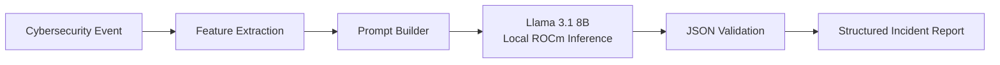

# SOCPilot AI

> A local Security Operations Center (SOC) assistant powered by **Meta Llama 3.1** and accelerated with **AMD ROCm**.


SOCPilot AI is a prototype Security Operations Center (SOC) assistant developed for the **AMD Radeon Hackathon 2026**.

The project demonstrates how a locally deployed Large Language Model (LLM) can assist security analysts by transforming cybersecurity events into structured incident reports. The entire inference pipeline runs locally on an AMD Radeon GPU through ROCm without relying on external AI services.

---

# Table of Contents

- [Overview](#overview)

- [Architecture](#architecture)

- [Project Workflow](#project-workflow)

- [Features](#features)

- [Repository Structure](#repository-structure)

- [Requirements](#requirements)

- [Installation](#installation)

- [Running the Project](#running-the-project)

- [Performance](#performance)

- [Example Output](#example-output)

- [Dataset](#dataset)

- [Model](#model)

- [AMD GPU Optimization](#amd-gpu-optimization)

- [Future Work](#future-work)

- [Acknowledgements](#acknowledgements)

- [License](#license)

---

# Overview

Security analysts spend a significant amount of time investigating alerts generated by Security Information and Event Management (SIEM) platforms. Typical analysis includes:

- Reviewing network events

- Identifying attack behavior

- Extracting Indicators of Compromise (IOCs)

- Mapping attacks to the MITRE ATT&CK framework

- Assessing severity and confidence

- Providing response recommendations

SOCPilot AI streamlines this workflow by combining lightweight Python preprocessing with a locally deployed Meta Llama 3.1 model running on AMD Radeon GPUs.

The current implementation focuses on network intrusion detection using the CICIDS2017 dataset and produces structured JSON reports suitable for SOC analysis and automation workflows.

---

# Architecture



---

# Project Workflow

```text

CICIDS2017 Dataset

        │

        ▼

summarize_dataset.py

        │

        ▼

Feature Extraction

        │

        ▼

Prompt Construction

        │

        ▼

Meta Llama 3.1

(Local ROCm Inference)

        │

        ▼

Structured JSON Report

        │

        ▼

SOC Analyst

```

---

# Features

- Local inference using Meta Llama 3.1 8B

- AMD ROCm GPU acceleration

- Lightweight Python preprocessing pipeline

- Structured JSON incident reports

- MITRE ATT&CK technique mapping

- IOC extraction

- Confidence scoring

- Security recommendations

- CICIDS2017 dataset integration

- Fully local execution without cloud APIs

---

# Repository Structure

```text

socpilot-ai/

├── app/

│   ├── test_llm.py

│   ├── summarize_dataset.py

│   └── ...

│

├── datasets/

│   └── cicids2017/

│

├── outputs/

│

├── README.md

│

└── requirements.txt

```

---

# Requirements

- Python 3.10+

- PyTorch

- Hugging Face Transformers

- pandas

- numpy

- accelerate

- AMD ROCm

---

# Installation

Clone the repository.

```bash

git clone https://github.com/cyberbryanzhang/Radeon-hackathon-2026-07.git

cd Radeon-hackathon-2026-07/socpilot-ai

```

Create a virtual environment (recommended).

```bash

python -m venv .venv

source .venv/bin/activate

```

Install dependencies.

```bash

pip install -r requirements.txt

```

---

# Running the Project

## Test Local LLM Inference

```bash

python app/test_llm.py

```

Expected output:

- Model loaded successfully

- AMD GPU detected

- Structured JSON response generated

- Output schema validation passed

---

## Generate Dataset Summary

```bash

python app/summarize_dataset.py

```

Expected output:

- Dataset statistics

- Attack label

- Feature summary

- Prompt-ready JSON

---

# Performance

| Item | Configuration |

|------|---------------|

| Language Model | Meta Llama 3.1 8B Instruct |

| Inference | Local |

| Hardware | AMD Radeon GPU |

| Runtime | ROCm |

| Precision | FP16 |

| Output | Structured JSON |

---

# Example Output

Example analysis generated from a PortScan event.

```json

{

  "severity": "High",

  "confidence": 90,

  "attack_type": "PortScan",

  "summary": "Possible network service scanning activity detected.",

  "mitre_attack": [

    {

      "technique_id": "T1046",

      "technique_name": "Network Service Scanning"

    }

  ],

  "iocs": [

    {

      "type": "IP",

      "value": "203.0.113.45"

    }

  ],

  "recommendations": [

    "Investigate the source host.",

    "Review firewall policies.",

    "Monitor for repeated scanning activity."

  ]

}

```

---

# Dataset

This project currently uses the **CICIDS2017** intrusion detection dataset.

The preprocessing pipeline extracts statistical information from network traffic before generating a concise summary for the language model.

Current demonstration scenarios include:

- PortScan

- Benign Traffic

The architecture is designed to support additional intrusion detection datasets in future work.

---

# Model

## Language Model

- Meta Llama 3.1 8B Instruct

## Inference Framework

- Hugging Face Transformers

- PyTorch

## Deployment

- Local inference

- FP16 precision

- AMD ROCm acceleration

---

# AMD GPU Optimization

The project is optimized for local execution on AMD Radeon GPUs.

Current optimizations include:

- ROCm-enabled PyTorch

- FP16 inference

- Automatic GPU device mapping

- Local model execution

- Reduced GPU memory usage through half precision

The entire inference pipeline is designed to perform all inference locally without sending security data to external cloud services.

---

# Future Work

Planned improvements include:

- Support additional intrusion detection datasets

- Real-time log ingestion

- Integration with Security Onion

- Integration with Splunk

- Interactive web dashboard

- Retrieval-Augmented Generation (RAG)

- Threat intelligence enrichment

- Multi-agent SOC workflows

- Automated incident report generation

- REST API deployment

---

# Acknowledgements

This project was built using the following open-source technologies:

- AMD ROCm

- Meta Llama 3.1

- Hugging Face Transformers

- PyTorch

- CICIDS2017

- University of Arizona

Special thanks to the AMD Radeon Hackathon organizers for providing the GPU development environment.

---

# License

This repository was developed for the **AMD Radeon Hackathon 2026** and is released for educational and research purposes.
