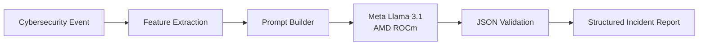

# SOCPilot AI

> A fully local Security Operations Center (SOC) assistant that transforms cybersecurity events into structured incident reports using **Meta Llama 3.1** accelerated by **AMD ROCm**.


SOCPilot AI is a prototype Security Operations Center assistant developed for the **AMD Radeon Hackathon 2026**.

The project demonstrates how a locally deployed Large Language Model (LLM) can assist security analysts by transforming cybersecurity events into structured incident reports. All inference is performed locally on AMD Radeon GPUs through ROCm without relying on external AI services.

---

# Overview

Security analysts spend significant time investigating alerts generated by SIEM platforms. Typical tasks include:

- Identifying attack behavior
- Extracting Indicators of Compromise (IOCs)
- Mapping attacks to the MITRE ATT&CK framework
- Assessing severity and confidence
- Generating response recommendations

SOCPilot AI streamlines this workflow through lightweight Python preprocessing and locally deployed Meta Llama 3.1 inference.

Current demonstrations use the **CICIDS2017** intrusion detection dataset.

---

# Architecture



---

# Workflow

```text
CICIDS2017 Dataset
        │
        ▼
summarize_dataset.py
        │
        ▼
Feature Extraction
        │
        ▼
Prompt Construction
        │
        ▼
Meta Llama 3.1
(Local ROCm Inference)
        │
        ▼
Structured JSON Report
```

---

# Features

- Fully local AI inference
- Meta Llama 3.1 8B
- AMD ROCm GPU acceleration
- Lightweight preprocessing pipeline
- Structured JSON incident reports
- MITRE ATT&CK mapping
- IOC extraction
- Confidence scoring
- Security recommendations
- CICIDS2017 integration
- Gradio web interface

---

# Repository Structure

```text
socpilot-ai/

├── app/
│   ├── analyze_flow.py
│   ├── summarize_dataset.py
│   ├── reporting.py
│   ├── web_demo.py
│   └── test_llm.py
│
├── datasets/
├── outputs/
├── README.md
└── requirements.txt
```

---

# Requirements

- Python 3.10+
- PyTorch
- Hugging Face Transformers
- AMD ROCm

---

# Installation

Clone the repository.

```bash
git clone https://github.com/cyberbryanzhang/Radeon-hackathon-2026-07.git

cd Radeon-hackathon-2026-07/socpilot-ai
```

Create a virtual environment.

```bash
python -m venv .venv
source .venv/bin/activate
```

Install dependencies.

```bash
pip install -r requirements.txt
```

---

# Running

## Test Local LLM

```bash
python app/test_llm.py
```

---

## Generate Dataset Summary

```bash
python app/summarize_dataset.py
```

---

## Launch Web Interface

```bash
python app/web_demo.py
```

Open your browser:

```
http://127.0.0.1:7860
```

Upload a summarized network-flow JSON file to generate:

- Structured incident report
- MITRE ATT&CK mapping
- IOC extraction
- Security recommendations

---

# Example Output

```json
{
  "severity": "High",
  "confidence": 90,
  "attack_type": "PortScan",
  "summary": "Possible network service scanning activity detected.",
  "mitre_attack": [
    {
      "technique_id": "T1046",
      "technique_name": "Network Service Scanning"
    }
  ],
  "iocs": [
    {
      "type": "IP",
      "value": "203.0.113.45"
    }
  ],
  "recommendations": [
    "Investigate the source host.",
    "Review firewall policies.",
    "Monitor for repeated scanning activity."
  ]
}
```

---

# AMD GPU Optimization

SOCPilot AI is optimized for local execution on AMD Radeon GPUs using ROCm.

Current optimizations include:

- ROCm-enabled PyTorch
- FP16 inference
- Automatic GPU device mapping
- Fully local execution
- No external AI services

---

# Future Work

- Real-time log ingestion
- Security Onion integration
- Splunk integration
- RAG-based threat intelligence
- Multi-agent SOC workflows
- REST API
- Interactive dashboard
- Additional intrusion detection datasets

---

# Acknowledgements

This project was built using:

- AMD ROCm
- Meta Llama 3.1
- Hugging Face Transformers
- PyTorch
- CICIDS2017

Special thanks to the AMD Radeon Hackathon organizers for providing the GPU development environment.

---

# License

Developed for the **AMD Radeon Hackathon 2026**.

Released for educational and research purposes.
